<div align="center">

# GenAI Research — Battery RUL / Capacity Forecasting

**Amazon Chronos (T5)** · **Train-only calibration** · **Case-1 in-battery** · **Case-2 cross-battery (2P1)** · **Case-3 LOO (3→1)**

[](https://www.python.org/)
[](https://pytorch.org/)
[](https://huggingface.co/amazon/chronos-t5-base)

*Pretrained time-series foundation models + strict leakage control + optional hybrid residuals.*

</div>

---

## Table of contents

1. [Why this repository exists](#1-why-this-repository-exists)
2. [Concepts: from beginner to advanced](#2-concepts-from-beginner-to-advanced)
3. [Repository map](#3-repository-map)
4. [Installation](#4-installation)
5. [Data layout](#5-data-layout)
6. [Pipeline A: `hybrid_pipeline.py` (Case 1)](#6-pipeline-a-hybrid_pipelinepy-case-1)
7. [Pipeline B: `hybrid_pipeline_case2.py` (Case 2)](#7-pipeline-b-hybrid_pipeline_case2py-case-2)
8. [Pipeline C: Case 3 — `hybrid_model_case3.py` (LOO 3→1)](#8-pipeline-c-case-3--hybrid_model_case3py-loo-31)
9. [Architecture diagrams](#9-architecture-diagrams)
10. [Chronos stack and hyperparameters](#10-chronos-stack-and-hyperparameters)
11. [Results and comparisons](#11-results-and-comparisons)
12. [Troubleshooting](#12-troubleshooting)
13. [Citation and license](#13-citation-and-license)

---

## 1. Why this repository exists

This project studies **next-step capacity forecasting** on lithium-ion battery health-indicator (HI) time series derived from NASA-style cycling data (cells **B0005, B0006, B0007, B0018**). The scientific goals are:

| Goal | What you measure |
|------|------------------|
| **Temporal generalization** | Train on early cycles, test on later cycles **of the same cell** (Case 1). |
| **Cross-battery generalization** | Train on **two** cells, test on a **held-out third** (Case 2, “2P1”). |
| **Strict cross-battery LOO** | Train on **three** cells, test on the **fourth** — **four folds**, 3000 rows each (Case 3). |

The flagship models are **Amazon Chronos** (probabilistic forecaster) with **post-hoc, train-only meta-calibration** (blend + ridge affine + clipping). Optionally, **residual networks** correct Chronos on training windows only.

---

## 2. Concepts: from beginner to advanced

### 2.1 Beginner: what is being predicted?

- Each CSV row is one **cycle** (or time index), with columns such as **`capacity`** and other engineered features.
- The pipeline builds **sliding windows** of length **`SEQ_LEN = 96`**: 96 consecutive rows of features.
- The **target** is **one step ahead**: capacity at the **next** timestep after the window ( **`PRED_LEN = 1`** ).

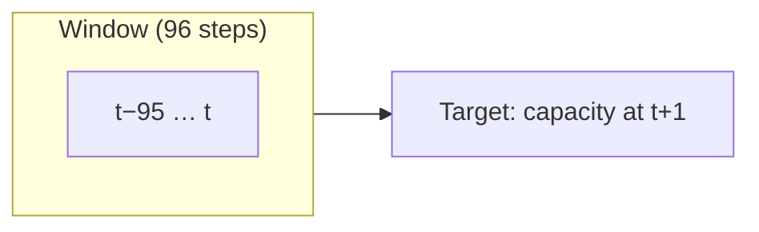
```mermaid
flowchart LR
  subgraph Window["Window (96 steps)"]
    W1["t−95 … t"]
  end
  Y["Target: capacity at t+1"]
  Window --> Y
```

### 2.2 Intermediate: scaling and leakage

- Features are standardized with **`sklearn.preprocessing.StandardScaler`**.
- The scaler is **always fit on training data only** (never on the test segment or test battery).
- **Case 2** additionally requires: windows are built **per battery** and then concatenated — **no window crosses two batteries**.

### 2.3 Advanced: why “Chronos Cal”?

Raw Chronos outputs can be mis-scaled or biased for your domain. This repo applies **train-only** steps:

1. **Clip** raw forecasts in scaled capacity space using train min/max + margin.
2. **Blend** two capacity contexts (long `L=96` and short `L=48`) with weight **`w ∈ {0.3, 0.5, 0.7}`**.
3. **Ridge affine map** **`y ≈ a·p + b`** (L2 on slope **`a`**, **`λ = 1e-3`**), fit on **all train windows** after **`w`** is chosen.

**`w`** is selected on an **internal chronological holdout** (last ~**12.5%** of **train** windows). The **held-out test set is never used** for tuning **`w`, `a`, or `b`**.

### 2.4 Expert: Chronos context shortcut

Chronos receives **only the capacity channel**, taken from **`x[:, :-1, cap_idx]`** — the **last timestep inside the window is excluded** before taking the trailing **`min(L, SEQ_LEN−1)`** steps. That keeps the context **strictly causal** relative to the one-step-ahead target and avoids an overly tight overlap with the immediate pre-target state.

---

## 3. Repository map

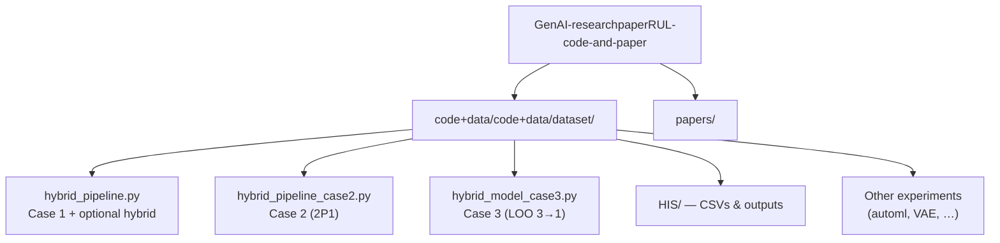
```mermaid
flowchart TB
  ROOT["GenAI-researchpaperRUL-code-and-paper"]
  ROOT --> DS["code+data/code+data/dataset/"]
  DS --> HP["hybrid_pipeline.py<br/>Case 1 + optional hybrid"]
  DS --> HC2["hybrid_pipeline_case2.py<br/>Case 2 (2P1)"]
  DS --> HC3["hybrid_model_case3.py<br/>Case 3 (LOO 3→1)"]
  DS --> HIS["HIS/ — CSVs & outputs"]
  DS --> OTHER["Other experiments<br/>(automl, VAE, …)"]
  ROOT --> PAPERS["papers/"]
```

| Path | Role |
|------|------|
| [`code+data/code+data/dataset/hybrid_pipeline.py`](code+data/code+data/dataset/hybrid_pipeline.py) | **Case 1**: single battery, last **3000** rows (if longer), **80% / 20%** chronological split. `USE_CHRONOS_ONLY = True` for Chronos + calibration only. |
| [`code+data/code+data/dataset/hybrid_pipeline_case2.py`](code+data/code+data/dataset/hybrid_pipeline_case2.py) | **Case 2**: exactly **3000** rows per battery; train on **2** cells, test on **3rd**; exports `case2_*.csv`. |
| [`code+data/code+data/dataset/hybrid_model_case3.py`](code+data/code+data/dataset/hybrid_model_case3.py) | **Case 3**: **LOO** — train **3** batteries, test **1** (4 folds); triple Chronos contexts; confidence blend + residual gate; `case3_results.csv` + `plots/case3_*.png`. |
| `code+data/code+data/dataset/HIS/` | Input `B*_synthetic+Real.csv`, Chronos `.npy` caches (ignored by git if matched), result CSVs. |
| `code+data/code+data/dataset/plots/` | Case-3 loss and prediction figures (and other experiment plots). |
| `papers/` | Paper-related materials. |

> **Note:** A file named `hybrid_pipeline - Case2.py` may exist alongside; prefer **`hybrid_pipeline_case2.py`** for Case-2 experiments to avoid confusion.

---

## 4. Installation

### 4.1 Environment

- **Python 3.10+**
- **PyTorch** (CUDA build optional, recommended for speed)
- **`chronos-forecasting`** (Chronos / Hugging Face)

### 4.2 Typical pip stack

```bash
pip install torch torchvision torchaudio --index-url https://download.pytorch.org/whl/cu124   # or CPU wheel from pytorch.org
pip install pandas numpy scikit-learn rich chronos-forecasting
```

### 4.3 Clone

```bash
git clone https://github.com/ujjwaltiwari01/GenAI-researchpaperRUL-code-and-paper.git
cd GenAI-researchpaperRUL-code-and-paper
```

---

## 5. Data layout

- Place battery CSVs under **`code+data/code+data/dataset/HIS/`** named like:
  - `B0005_synthetic+Real.csv`
  - `B0006_synthetic+Real.csv`
  - `B0007_synthetic+Real.csv`
  - `B0018_synthetic+Real.csv`
- Each file should include a **`cycle`** column (sorted ascending in code) and a **`capacity`** column among features.

### 5.1 Fix `HIS_DIR` on a new machine

`hybrid_pipeline.py` uses a **hard-coded** `HIS_DIR` (Windows path in source). **Edit** it to your local path, or mirror the **script-relative** pattern used in `hybrid_pipeline_case2.py`:

```python
SCRIPT_DIR = os.path.dirname(os.path.abspath(__file__))
HIS_DIR = os.path.join(SCRIPT_DIR, "HIS")
```

---

## 6. Pipeline A: `hybrid_pipeline.py` (Case 1)

### 6.1 What it does

1. Load one battery CSV (CLI argument), sort by **`cycle`**, keep last **`LAST_N_ROWS = 3000`** if the file is longer.
2. Split **chronologically**: **80% train**, **20% test** (`VAL_RATIO = 0`).
3. Fit **`StandardScaler`** on **train rows only**; transform train/test.
4. Build sliding windows; run **Chronos** for each context length (**96**, **48** by default).
5. Aggregate stochastic **`num_samples`** with **mean** on the Chronos-only path.
6. **Meta-calibrate** (clip → blend → ridge) using **train windows only**.
7. Evaluate **MAE / RMSE** on test in **original Ah** (inverse transform).
8. Compare to **`BENCHMARKS`** (H2O-style reference MAE/RMSE embedded in code).

### 6.2 Run commands

```bash
# Single battery (default B0005 if omitted)
python code+data/code+data/dataset/hybrid_pipeline.py B0005

# Several batteries in one invocation
python code+data/code+data/dataset/hybrid_pipeline.py B0005 B0006 B0007 B0018
```

### 6.3 Toggle Chronos-only vs hybrid

In source: **`USE_CHRONOS_ONLY = True`** → final metrics use **Chronos + calibration** only. Set to **`False`** to train **PatchTSTResidual** + **TinyTimeMixer** on residuals (Chronos base uses **`chronos-t5-small`** + median in that branch).

### 6.4 Case-1 flowchart

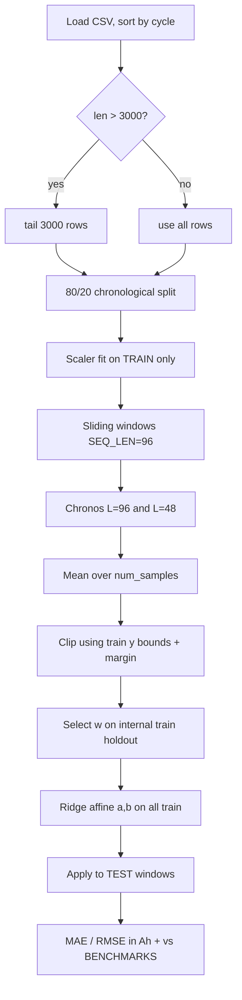
```mermaid
flowchart TB
  A[Load CSV, sort by cycle] --> B{len > 3000?}
  B -->|yes| C[tail 3000 rows]
  B -->|no| D[use all rows]
  C --> E[80/20 chronological split]
  D --> E
  E --> F[Scaler fit on TRAIN only]
  F --> G[Sliding windows SEQ_LEN=96]
  G --> H[Chronos L=96 and L=48]
  H --> I[Mean over num_samples]
  I --> J[Clip using train y bounds + margin]
  J --> K[Select w on internal train holdout]
  K --> L[Ridge affine a,b on all train]
  L --> M[Apply to TEST windows]
  M --> N[MAE / RMSE in Ah + vs BENCHMARKS]
```

---

## 7. Pipeline B: `hybrid_pipeline_case2.py` (Case 2)

### 7.1 What it does (2P1 cross-battery)

1. **`verify_all_batteries()`**: each of **B0005, B0006, B0007, B0018** must yield exactly **`LAST_N = 3000`** rows after `tail(3000)`.
2. For each case in **`CASE_2_CONFIG`**:
   - **Concatenate** the two training batteries (**6000** rows).
   - **`StandardScaler.fit`** on those **6000** rows only.
   - Transform each battery; build windows **per battery**; **merge** train windows (no cross-battery windows).
   - Run Chronos ( **`median`** over samples in this script), clip, **`fit_blend_and_affine`** on **train** only.
   - Train **two residual nets** on **`(y − Chronos_cal)`** with early stopping on the **last 15%** of train windows.
   - **Hybrid prediction** on test: **`Chronos_cal + 0.5·(r1 + r2)`** (residuals scaled /10 in training as in code).
3. Save **`case2_{case_tag}_test_{battery}.csv`** under **`HIS/`** with columns: `true`, `pred_hybrid`, `pred_chronos_cal`, `pred_chronos_raw_L`, `last_obs_window`.
4. Print Rich table: **Naive**, **Chronos raw**, **Chronos cal.**, **Hybrid**, vs **H2O** benchmarks.

### 7.2 Case configurations

| Case index | Train batteries | Test battery |
|------------|-----------------|--------------|
| **0** | B0005, B0006 | **B0007** |
| **1** | B0005, B0007 | **B0018** |
| **2** | B0007, B0006 | **B0005** |
| **3** | B0007, B0018 | **B0006** |

### 7.3 Run commands

```bash
cd code+data/code+data/dataset

# All four cases
python hybrid_pipeline_case2.py

# Single case (e.g. case 0 only)
python hybrid_pipeline_case2.py 0
```

`HIS_DIR` is **`os.path.join(script_dir, "HIS")`** — portable if you run from the dataset folder.

### 7.4 Case-2 data-flow (leakage-safe)

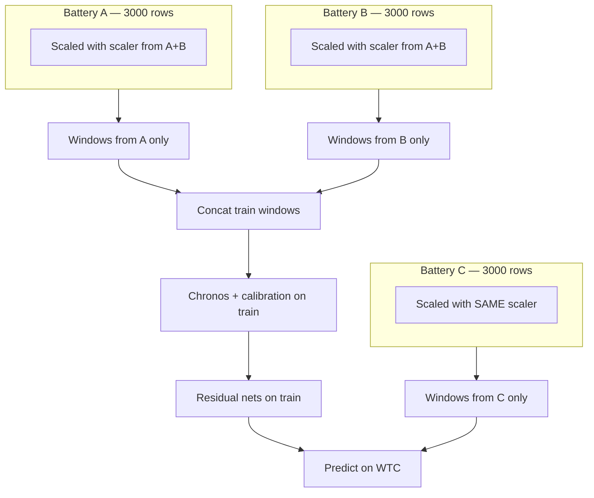
```mermaid
flowchart TB
  subgraph TrainA["Battery A — 3000 rows"]
    TA[Scaled with scaler from A+B]
  end
  subgraph TrainB["Battery B — 3000 rows"]
    TB[Scaled with scaler from A+B]
  end
  subgraph TestC["Battery C — 3000 rows"]
    TC[Scaled with SAME scaler]
  end
  TrainA --> WA[Windows from A only]
  TrainB --> WB[Windows from B only]
  WA --> MERGE[Concat train windows]
  WB --> MERGE
  MERGE --> CHR[Chronos + calibration on train]
  CHR --> RES[Residual nets on train]
  TestC --> WTC[Windows from C only]
  RES --> PRED[Predict on WTC]
  WTC --> PRED
```

### 7.5 Important: what “Beat?” means in code

In `run_case()`, the **`Beat?`** column for the **hybrid** row compares **`mae_hyb` / `rmse_hyb`** to **`H2O_MAE` / `H2O_RMSE`**. The table **still prints** Chronos raw and **Chronos cal.** MAE/RMSE so you can report **Chronos-only** performance from the same run or from the exported CSV.

---

## 8. Pipeline C — Case 3 (`hybrid_model_case3.py`, LOO 3→1)

**Case 3** is the strictest **cross-battery** benchmark in this repo: **leave-one-out (LOO)** with **three training batteries** and **one held-out test battery**, **3000 chronological rows per cell**, **train-only calibration**, and a **hybrid forecaster** that combines **Chronos** (multi-context, probabilistic) with **two residual networks** and an optional **confidence gate**. It is designed for **publication-grade** logging, **√MSE RMSE**, and **no test leakage**.

### 8.1 Case 1 vs Case 2 vs Case 3 (at a glance)

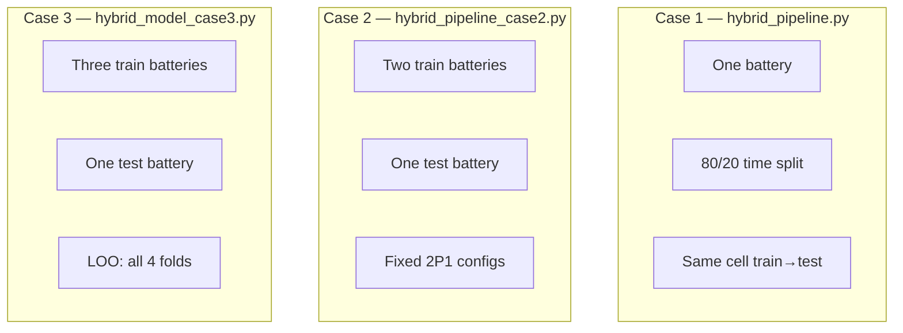
```mermaid
flowchart TB
  subgraph C1["Case 1 — hybrid_pipeline.py"]
    A1[One battery]
    A2[80/20 time split]
    A3[Same cell train→test]
  end
  subgraph C2["Case 2 — hybrid_pipeline_case2.py"]
    B1[Two train batteries]
    B2[One test battery]
    B3[Fixed 2P1 configs]
  end
  subgraph C3["Case 3 — hybrid_model_case3.py"]
    D1[Three train batteries]
    D2[One test battery]
    D3[LOO: all 4 folds]
  end
```

| Aspect | Case 1 | Case 2 | Case 3 |
|--------|--------|--------|--------|
| Train scope | Early segment, **same** cell | **2** cells × 3000 | **3** cells × 3000 |
| Test scope | Late segment, **same** cell | **1** cell × 3000 | **1** cell × 3000 |
| Cross-battery | No | Yes (one split per case) | Yes (**4** LOO folds) |
| Chronos contexts | 96 + 48 (typical) | 96 + 48 | **96, 64, 48** (default) |
| Chronos aggregate | Mean (Chronos-only path) | Median | **Median** over `num_samples` |
| Calibration | Clip + blend + ridge | Clip + blend + ridge | + **grid or inverse-variance blend** |
| Residuals | Optional | 0.5·r1 + 0.5·r2 | **0.6·r1 + 0.4·r2** + optional **gate** + **B0006** rule |

### 8.2 LOO fold design (four experiments)

Each row is one full training run; the **test** column is never seen during scaler fit, calibration, or residual training.

| Fold | Train batteries (3 × 3000) | Test battery |
|------|----------------------------|--------------|
| **0** | B0006, B0007, B0018 | **B0005** |
| **1** | B0005, B0007, B0018 | **B0006** |
| **2** | B0005, B0006, B0018 | **B0007** |
| **3** | B0005, B0006, B0007 | **B0018** |

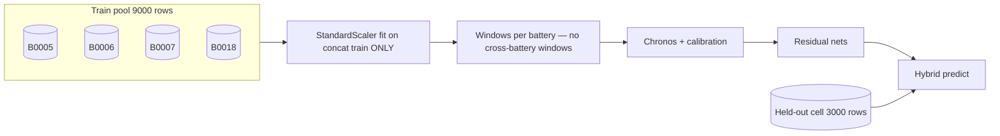
```mermaid
flowchart LR
  subgraph T["Train pool 9000 rows"]
    B5[(B0005)]
    B6[(B0006)]
    B7[(B0007)]
    B18[(B0018)]
  end
  T --> S[StandardScaler fit on concat train ONLY]
  S --> W[Windows per battery — no cross-battery windows]
  W --> CH[Chronos + calibration]
  CH --> R[Residual nets]
  R --> H[Hybrid predict]
  X[(Held-out cell 3000 rows)] --> H
```

### 8.3 Strict data protocol (no leakage)

1. Load each CSV, sort by **`cycle`**, keep **exactly last `LAST_N = 3000` rows** (assert).
2. **`StandardScaler`**: **`fit`** on **concatenated train batteries only** (9000 rows); **transform** train and test with that scaler.
3. **Sliding windows** (`SEQ_LEN = 96`, `PRED_LEN = 1`): built **inside each battery**, then concatenated — **no window spans two batteries**.
4. **Chronos context**: capacity channel from **`x[:, :-1, cap_idx]`** (last in-window step excluded), then trailing **`min(L, SEQ_LEN−1)`** steps for each context length **L ∈ {96, 64, 48}**.
5. **Calibration**: internal **85% / 15%** chronological split on **train windows** to choose nonnegative context weights (sum = 1); **ridge affine** refit on **all** train windows. **Test never used.**
6. **Residual target**: scaled **`(y − Chronos_cal) × 10`**; inference divides by 10.
7. **Final predictions**: optional **adaptive clip** in scaled space using **train** mean ± 3× train std (train stats only).

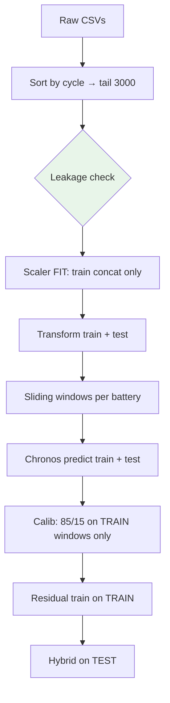
```mermaid
flowchart TB
  D[Raw CSVs] --> L[Sort by cycle → tail 3000]
  L --> V{Leakage check}
  V --> F[Scaler FIT: train concat only]
  F --> G[Transform train + test]
  G --> SW[Sliding windows per battery]
  SW --> CR[Chronos predict train + test]
  CR --> CA[Calib: 85/15 on TRAIN windows only]
  CA --> RE[Residual train on TRAIN]
  RE --> HY[Hybrid on TEST]
  style V fill:#e8f5e9
```

### 8.4 Chronos stack (Case 3)

- **Model**: `amazon/chronos-t5-base` by default (env `CHRONOS_MODEL`, optional `CHRONOS_USE_LARGE=1` on high-VRAM GPUs).
- **dtype**: **float16** for Chronos weights/inference where supported.
- **`num_samples`**: default **32** (env `CHRONOS_NUM_SAMPLES`).
- **Aggregation**: **median** across samples at the one-step horizon.
- **Performance**: `cudnn.benchmark=True`, `cudnn.deterministic=False`; inference under `torch.inference_mode()`; DataLoader **`pin_memory=True`** when CUDA.

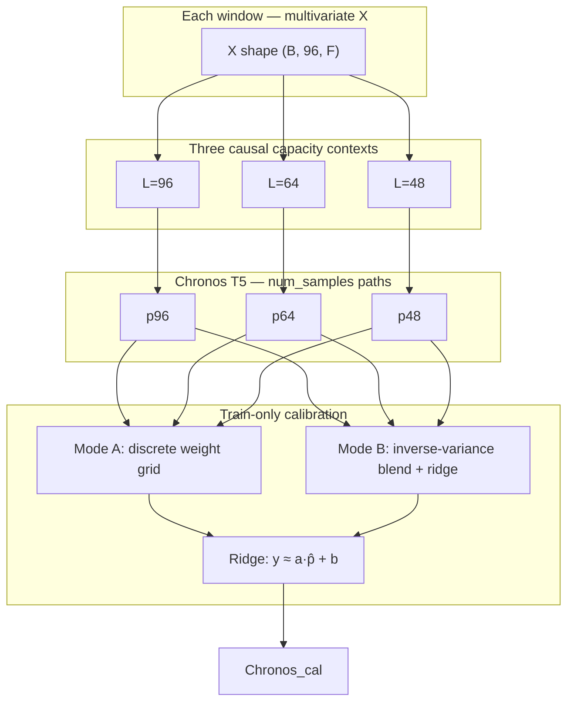
```mermaid
flowchart TB
  subgraph Win["Each window — multivariate X"]
    XF["X shape (B, 96, F)"]
  end
  subgraph Ctx["Three causal capacity contexts"]
    L96["L=96"]
    L64["L=64"]
    L48["L=48"]
  end
  XF --> L96 & L64 & L48
  subgraph Chr["Chronos T5 — num_samples paths"]
    P96[p96]
    P64[p64]
    P48[p48]
  end
  L96 --> P96
  L64 --> P64
  L48 --> P48
  subgraph Cal["Train-only calibration"]
    GRID["Mode A: discrete weight grid"]
    CONF["Mode B: inverse-variance blend + ridge"]
    AF["Ridge: y ≈ a·p̂ + b"]
  end
  P96 & P64 & P48 --> GRID
  P96 & P64 & P48 --> CONF
  GRID --> AF
  CONF --> AF
  AF --> CCAL["Chronos_cal"]
```

### 8.5 Confidence blend & residual gate (default on)

When **`CASE3_USE_CONFIDENCE_BLEND`** is on (default):

- **Per context**, estimate **variance across `num_samples`** at the forecast step; blend the three Chronos medians with weights **∝ 1 / (var + ε)** (normalized).
- Apply the same **ridge affine** on the blended prediction (train-only).
- **Residual gate** (test-time): combine PatchTST + TinyTimeMixer residuals **`r_mix`**, build **`r_conf ∝ 1/(√|r_mix| + ε)`**, optionally modulate by Chronos uncertainty, normalize, clip to **[floor, cap]**, optional **EMA** across batches, then **`r_eff = α · r_conf · r_mix`** (defaults **α = 0.85**, **EMA β = 0.7**).

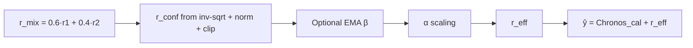
```mermaid
flowchart LR
  CM[r_mix = 0.6·r1 + 0.4·r2]
  GC[r_conf from inv-sqrt + norm + clip]
  EM[Optional EMA β]
  AL["α scaling"]
  CM --> GC --> EM --> AL --> RE[r_eff]
  RE --> YH["ŷ = Chronos_cal + r_eff"]
```

**Grid mode** (blend off): scan a fixed discrete set of nonnegative triples **`(w96, w64, w48)`** summing to 1 on the calibration tail; pick best MAE; refit affine on full train (same leakage rules).

### 8.6 Residual networks & hybrid prediction

- **PatchTST-style** residual (`PatchTSTResidual`) and **TinyTimeMixer** (`TinyTimeMixer`) predict the **scaled residual** from full window features + **Chronos_cal** + **last capacity**.
- **Ensemble**: **`0.6 · r̂1 + 0.4 · r̂2`** (scaled space), then add to **Chronos_cal** for hybrid capacity in scaled space → inverse transform to Ah.
- **B0006 safeguard**: if validation MAE (Ah) exceeds a threshold, apply a **damped** residual fallback (documented in script logs).

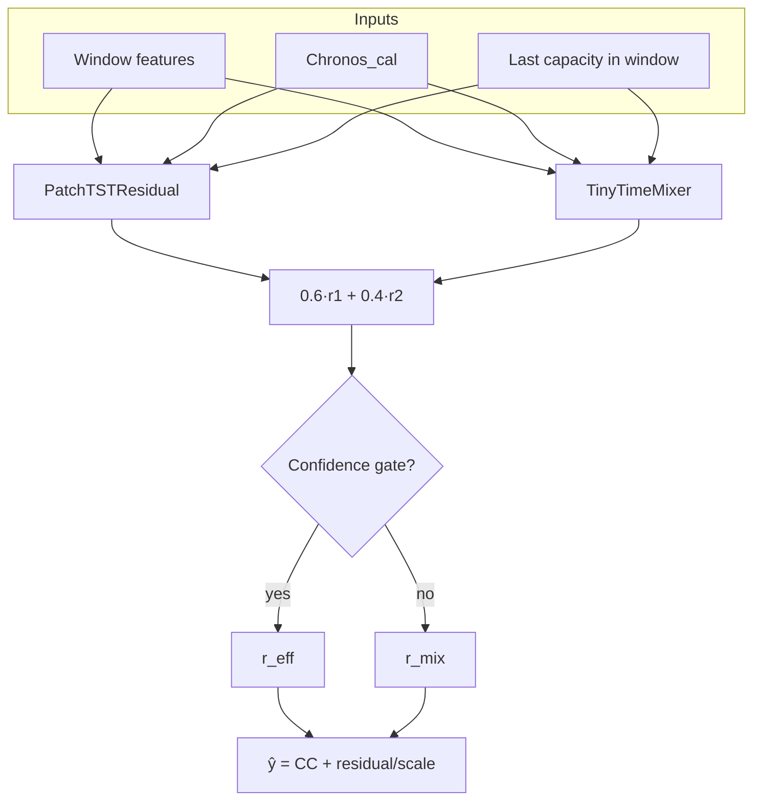
```mermaid
flowchart TB
  subgraph Inputs
    XW[Window features]
    CC[Chronos_cal]
    LC[Last capacity in window]
  end
  XW --> M1[PatchTSTResidual]
  CC --> M1
  LC --> M1
  XW --> M2[TinyTimeMixer]
  CC --> M2
  LC --> M2
  M1 --> E["0.6·r1 + 0.4·r2"]
  M2 --> E
  E --> G{Confidence gate?}
  G -->|yes| GE[r_eff]
  G -->|no| GE2[r_mix]
  GE --> SUM["ŷ = CC + residual/scale"]
  GE2 --> SUM
```

### 8.7 Training loop (residuals)

- **Optimizer**: Adam-style training with **gradient clip** (default **1.0**).
- **Epochs**: up to **200**, **early stopping** patience **20** on validation loss.
- **Rich** progress bars for Chronos batches and epoch loops.
- **Weighted** first 85% of train windows (linear ramp) for residual training; val = last 15% of train windows.

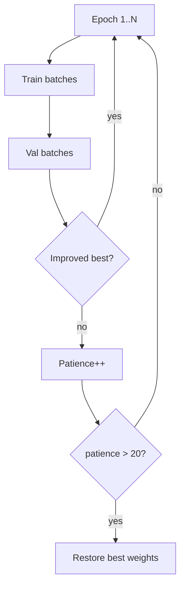
```mermaid
flowchart TB
  E0[Epoch 1..N] --> TR[Train batches]
  TR --> VL[Val batches]
  VL --> ES{Improved best?}
  ES -->|no| PC[Patience++]
  PC --> STOP{patience > 20?}
  STOP -->|yes| DONE[Restore best weights]
  STOP -->|no| E0
  ES -->|yes| E0
```

### 8.8 Metrics & sanity panel

- **Test MAE / RMSE** in **Ah**: RMSE = **`sqrt(mean_squared_error)`** exactly.
- **H2O baselines**: **`H2O_MAE`** and **`H2O_RMSE`** are **explicit** dictionaries in code (RMSE is **not** approximated as k×MAE).
- **Sanity log** (per fold): mean |y − naive|, |y − Chronos raw|, |y − hybrid|, plus **improvement %** vs baselines.

### 8.9 Key hyperparameters (defaults)

| Symbol / setting | Typical value | Notes |
|------------------|---------------|--------|
| `LAST_N` | 3000 | Per battery |
| `SEQ_LEN` / `PRED_LEN` | 96 / 1 | One-step ahead |
| Contexts | (96, 64, 48) | `CASE3_CONTEXTS` override |
| `CHRONOS_NUM_SAMPLES` | 32 | Stochastic paths |
| `CALIB_HOLDOUT_FRAC` | 0.15 | Tail of **train** windows |
| `AFFINE_RIDGE_LAMBDA` | 1e-3 | Ridge on slope |
| `RESIDUAL_SCALE` | 10 | Residual target scaling |
| `RESIDUAL_EPOCHS` / `RESIDUAL_PATIENCE` | 200 / 20 | Early stopping |
| `GRAD_CLIP_NORM` | 1.0 | |
| `CASE3_USE_CONFIDENCE_BLEND` | on (default) | Set `0` for grid mode |
| `RESIDUAL_GATE_ALPHA` | 0.85 | Gate strength |
| `CASE3_RESIDUAL_GATE_SMOOTH_BETA` | 0.7 | EMA across batches (optional off) |
| `BATCH_SIZE` (train) | 256 env default | **Auto-capped** on low VRAM GPUs |
| `CHRONOS_INFER_BATCH` | env or VRAM tiers | **4** class on ~4 GiB cards |

### 8.10 Environment variables (quick reference)

| Variable | Role |
|----------|------|
| `CASE3_USE_CONFIDENCE_BLEND` | `1` / `0` — inverse-variance + gate vs weight grid |
| `CHRONOS_NUM_SAMPLES` | Stochastic sample count |
| `CASE3_RESIDUAL_GATE_ALPHA` | α in gate |
| `CASE3_RESIDUAL_GATE_SMOOTH_BETA` | EMA β (0–1) |
| `CASE3_TRAIN_BATCH` | Requested train batch (may be capped on small GPU) |
| `CHRONOS_INFER_BATCH` | Override Chronos micro-batch |
| `CHRONOS_LOW_VRAM` / `CASE3_LOW_VRAM` | Force conservative batches |
| `CHRONOS_USE_LARGE` | Prefer large Chronos when VRAM allows |
| `PYTORCH_CUDA_ALLOC_CONF` | e.g. `expandable_segments:True` if fragmentation |

### 8.11 How to run

```bash
cd code+data/code+data/dataset

# All four LOO folds (default)
export CASE3_USE_CONFIDENCE_BLEND=1
export CHRONOS_NUM_SAMPLES=32
export CASE3_RESIDUAL_GATE_ALPHA=0.85
export CASE3_RESIDUAL_GATE_SMOOTH_BETA=0.7
python hybrid_model_case3.py

# Single fold only (e.g. fold 0)
python hybrid_model_case3.py 0
```

**PowerShell (Windows)**

```powershell
cd "path\to\repo\code+data\code+data\dataset"
$env:CASE3_USE_CONFIDENCE_BLEND="1"
$env:CHRONOS_NUM_SAMPLES="32"
$env:CASE3_RESIDUAL_GATE_ALPHA="0.85"
$env:CASE3_RESIDUAL_GATE_SMOOTH_BETA="0.7"
python hybrid_model_case3.py
```

### 8.12 Low VRAM (e.g. 4 GB laptop GPUs)

The script **auto-reduces** Chronos inference batch and train batch from total VRAM; on **CUDA OOM** it **splits** the current Chronos batch recursively until it succeeds. Optional **`CHRONOS_LOW_VRAM=1`** / **`CASE3_LOW_VRAM=1`** force extra-conservative settings.

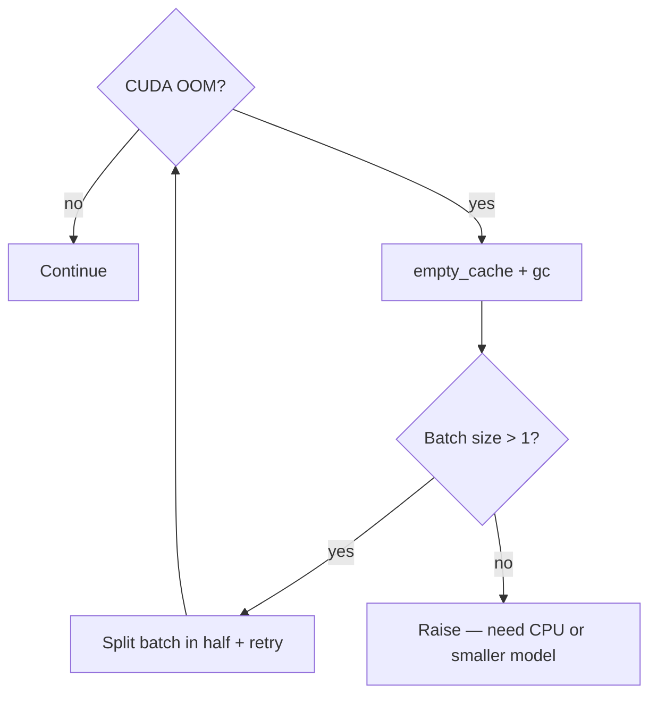
```mermaid
flowchart TD
  Q{CUDA OOM?}
  Q -->|no| OK[Continue]
  Q -->|yes| E[empty_cache + gc]
  E --> H{Batch size > 1?}
  H -->|yes| SP[Split batch in half + retry]
  H -->|no| FAIL[Raise — need CPU or smaller model]
  SP --> Q
```

### 8.13 Outputs

| Output | Location |
|--------|----------|
| Per-fold metrics + diagnostics | `HIS/case3_results.csv` |
| Loss curves | `plots/case3_loss_{B}.png` |
| Prediction vs actual (+ error) | `plots/case3_prediction_{B}.png` |

### 8.14 Reference figures (from a full Case-3 run)

*Smoothed plots for readability; exact numbers are in `case3_results.csv` and the console table.*

#### Loss curves (residual training, merged across the two residual models)

| B0005 | B0006 |
|:-----:|:-----:|
| 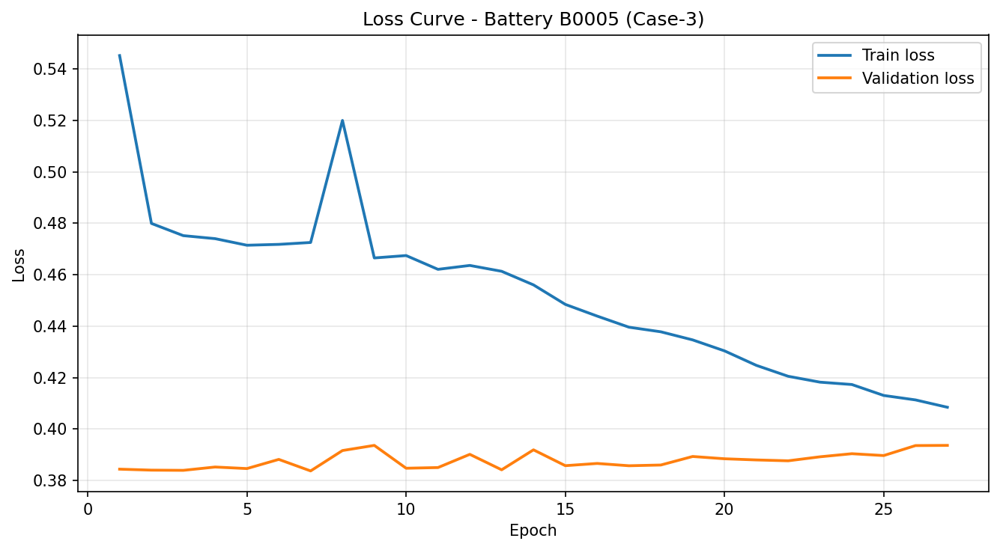 | 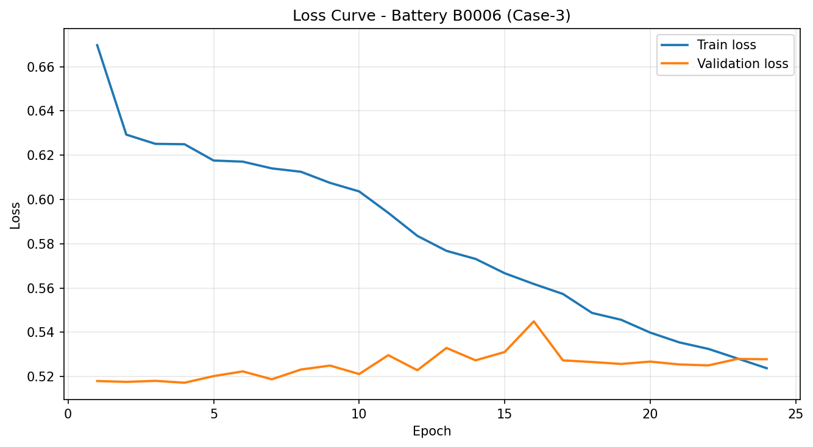 |

| B0007 | B0018 |
|:-----:|:-----:|
| 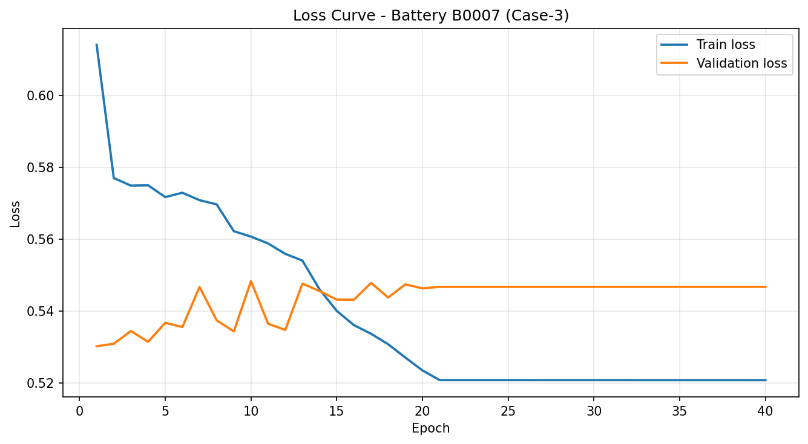 | 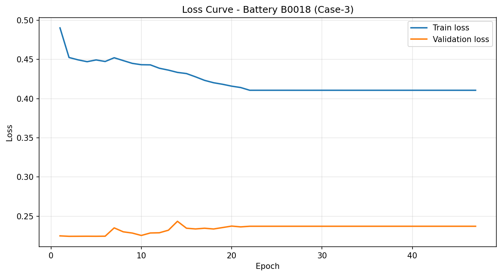 |

#### Capacity prediction vs actual (test windows)

| B0005 | B0006 |
|:-----:|:-----:|
| 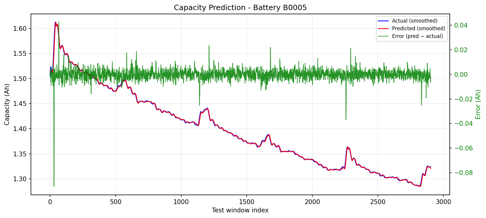 | 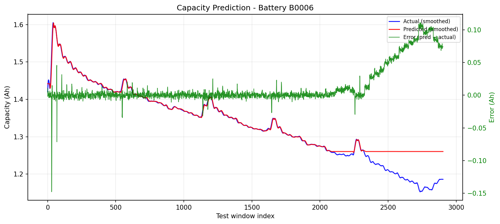 |

| B0007 | B0018 |
|:-----:|:-----:|
| 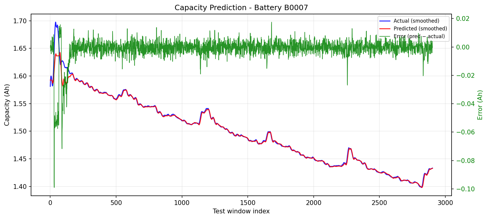 | 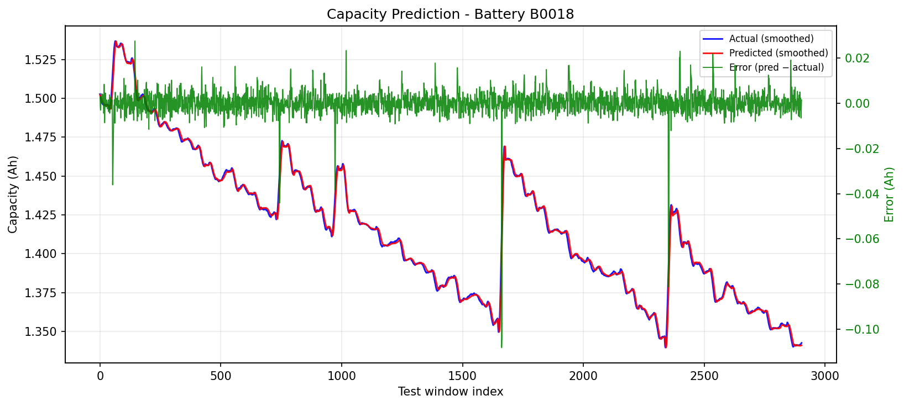 |

**Reading the prediction plots:** overlap of **predicted** (red) and **actual** (blue) indicates strong tracking; the **green** error channel should stay near zero. **B0006** often shows a **late-test** regime where the hybrid line can **flatten** while capacity keeps falling — discuss as **limitation / extrapolation** or **clipping** behavior, not as a rendering bug.

### 8.15 End-to-end Case-3 pipeline (summary)

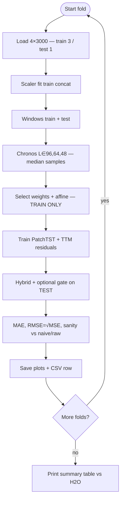
```mermaid
flowchart TB
  START([Start fold]) --> DATA[Load 4×3000 — train 3 / test 1]
  DATA --> SC[Scaler fit train concat]
  SC --> WIN[Windows train + test]
  WIN --> CHR[Chronos L∈96,64,48 — median samples]
  CHR --> CAL[Select weights + affine — TRAIN ONLY]
  CAL --> RES[Train PatchTST + TTM residuals]
  RES --> HYB[Hybrid + optional gate on TEST]
  HYB --> MET[MAE, RMSE=√MSE, sanity vs naive/raw]
  MET --> PLOT[Save plots + CSV row]
  PLOT --> NEXT{More folds?}
  NEXT -->|yes| START
  NEXT -->|no| TBL[Print summary table vs H2O]
```

---

## 9. Architecture diagrams

### 9.1 System context

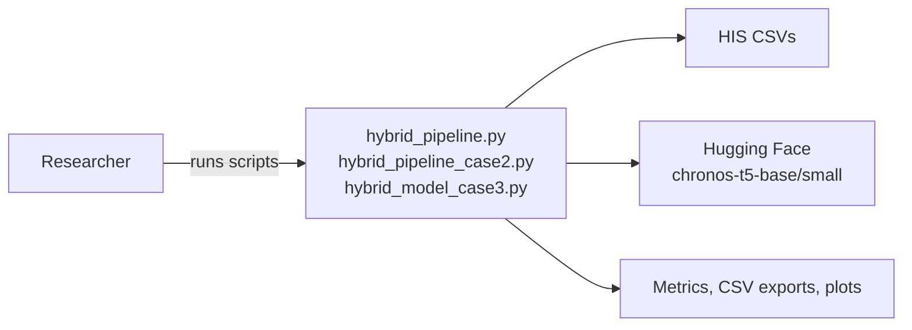
```mermaid
flowchart LR
  R[Researcher] -->|runs scripts| P["hybrid_pipeline.py<br/>hybrid_pipeline_case2.py<br/>hybrid_model_case3.py"]
  P --> CSV[HIS CSVs]
  P --> HF[Hugging Face<br/>chronos-t5-base/small]
  P --> OUT[Metrics, CSV exports, plots]
```

*(GitHub renders Mermaid in README files.)*

### 9.2 Chronos + calibration (logical)

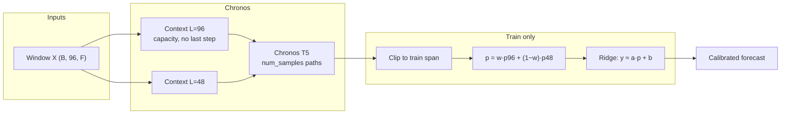
```mermaid
flowchart LR
  subgraph Inputs
    X["Window X (B, 96, F)"]
  end
  subgraph Chronos
    C96["Context L=96<br/>capacity, no last step"]
    C48["Context L=48"]
    T5["Chronos T5<br/>num_samples paths"]
  end
  subgraph Meta["Train only"]
    CLIP["Clip to train span"]
    BLEND["p = w·p96 + (1−w)·p48"]
    AFF["Ridge: y ≈ a·p + b"]
  end
  X --> C96
  X --> C48
  C96 --> T5
  C48 --> T5
  T5 --> CLIP --> BLEND --> AFF
  AFF --> YHAT["Calibrated forecast"]
```

### 9.3 Optional hybrid residual (Case 2)

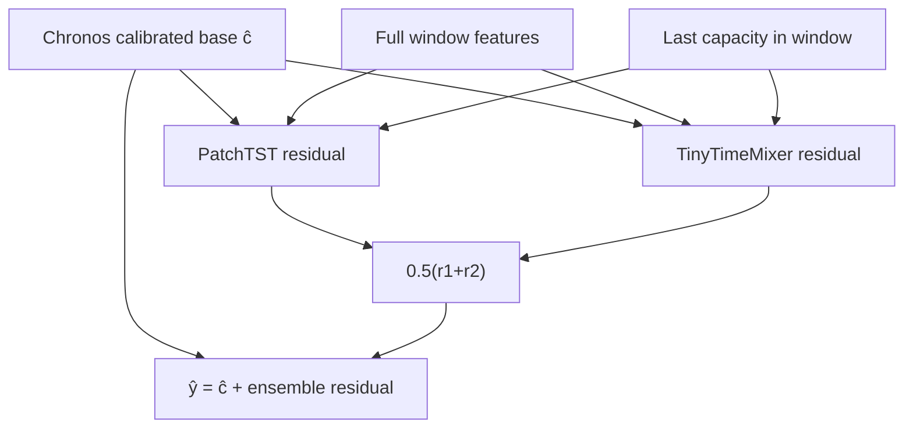
```mermaid
flowchart TB
  CC[Chronos calibrated base ĉ] --> R1[PatchTST residual]
  CC --> R2[TinyTimeMixer residual]
  XW[Full window features] --> R1
  XW --> R2
  LC[Last capacity in window] --> R1
  LC --> R2
  R1 --> ENS["0.5(r1+r2)"]
  R2 --> ENS
  CC --> SUM["ŷ = ĉ + ensemble residual"]
  ENS --> SUM
```

---

## 10. Chronos stack and hyperparameters

### 10.1 Model and inference

| Parameter | Case 1 (`hybrid_pipeline.py`) | Case 2 (`hybrid_pipeline_case2.py`) |
|-----------|-------------------------------|-------------------------------------|
| Primary model | `CHRONOS_MODEL` env or **`amazon/chronos-t5-base`** | Same |
| Fallback | **`amazon/chronos-t5-small`** | Same |
| `prediction_length` | **1** | **1** |
| `num_samples` | **12** (env `CHRONOS_NUM_SAMPLES`) | Same |
| Sample aggregate | **Mean** (Chronos-only path) | **Median** |
| Context lengths | **(96, 48)** default; override via `CHRONOS_CONTEXTS` / `CHRONOS_SINGLE_CONTEXT` | **(96, 48)** fixed in script |
| Inference batch | Auto from VRAM or `CHRONOS_INFER_BATCH` | Same pattern |

### 10.2 Meta-calibration

| Parameter | Default | Meaning |
|-----------|---------|---------|
| `CHRONOS_BLEND_GRID` | **0.3, 0.5, 0.7** | Candidate blend weights **`w`** |
| `CHRONOS_CALIB_HOLDOUT_FRAC` | **0.125** | Fraction of **train windows** (tail) to score **`w`** |
| `AFFINE_RIDGE_LAMBDA` | **1e-3** | Ridge penalty on slope **`a`** |
| `CHRONOS_CLIP_MARGIN_FRAC` | **0.05** | Expand train min/max by **5%** of span |

### 10.3 Case-1 split and windowing

| Parameter | Value |
|-----------|--------|
| `LAST_N_ROWS` | **3000** (if CSV longer) |
| `TRAIN_RATIO` / `TEST_RATIO` | **0.80** / **0.20** |
| `SEQ_LEN` | **96** |

### 10.4 Case-2 benchmarks (embedded)

**MAE** targets in `hybrid_pipeline_case2.py`:

| Battery | H2O MAE (reference) |
|---------|---------------------|
| B0005 | 0.0107 |
| B0006 | 0.0115 |
| B0007 | 0.0084 |
| B0018 | 0.0128 |

**RMSE** in code is **`round(1.28 × MAE, 4)`** unless you replace with published RMSE from the same source as MAE.

**Case-1** `BENCHMARKS` in `hybrid_pipeline.py` use a **different** MAE/RMSE table (per-battery) — do **not** mix Case-1 and Case-2 baseline tables in the same slide without labeling them.

---

## 11. Results and comparisons

### 11.1 How to read the metrics

- **MAE (Ah):** mean absolute error in **original capacity units** after inverse scaling.
- **RMSE (Ah):** root mean squared error — **punishes large errors** more than MAE.
- **Naive:** predict next capacity = **last capacity inside the window** (`lc`).
- **Chronos raw:** long-context branch after median/mean and inverse transform (see script).
- **Chronos cal.:** after clip + blend + ridge.
- **Hybrid (Case 2 & Case 3):** calibrated Chronos + residual ensemble (Case 2: **0.5·(r1+r2)**; Case 3: **0.6·r1 + 0.4·r2** + optional gate).

### 11.2 Case 1 — Chronos Cal vs H2O-style benchmarks

Results below match the **embedded `BENCHMARKS`** in `hybrid_pipeline.py` (MAE/RMSE) and **representative Chronos Cal** outcomes from project experiments. **Green** = Chronos Cal lower error than benchmark.

| Battery | H2O MAE | H2O RMSE | Chronos Cal MAE | Chronos Cal RMSE | Verdict |
|---------|---------|----------|-----------------|------------------|---------|
| **B0005** | 0.0097 | 0.0127 | **0.004243** | **0.006647** | Win |
| **B0006** | 0.0258 | 0.0323 | 0.037903 | 0.04357 | **Fail** — hard cell |
| **B0007** | 0.0093 | 0.0109 | **0.005285** | **0.007133** | Win |
| **B0018** | 0.0093 | 0.0130 | **0.003059** | **0.004308** | Win |

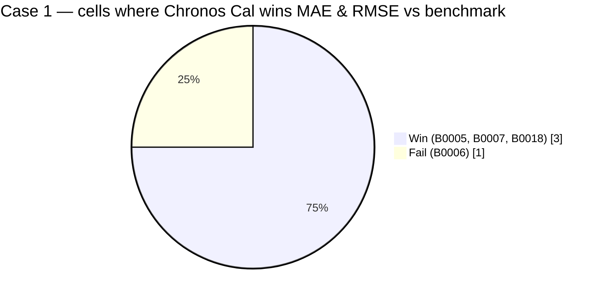
```mermaid
pie showData
  title Case 1 — cells where Chronos Cal wins MAE & RMSE vs benchmark
  "Win (B0005, B0007, B0018)" : 3
  "Fail (B0006)" : 1
```

*Use the numeric table above for exact MAE/RMSE; this pie summarizes win count.*

**Talking points**

- **3 / 4** cells favor Chronos Cal on both MAE and RMSE in this table.
- **B0006** is a consistent **outlier** — useful discussion: domain shift, noise, or capacity regime vs other cells.
- **B0018** shows the **largest relative gap** vs benchmarks.

### 11.3 Case 2 — Cross-battery (2P1)

Same **Chronos Cal** numbers can appear when the **test tail** is the same **3000** rows as in Case 1; **training** batteries differ. Compare to **`H2O_MAE` / `H2O_RMSE`** in `hybrid_pipeline_case2.py`.

| Test cell | Train on | H2O MAE | Chronos Cal MAE | Chronos Cal RMSE | Verdict (Chronos Cal vs H2O) |
|-----------|----------|---------|-----------------|------------------|-------------------------------|
| **B0007** | B0005+B0006 | 0.0084 | **0.005285** | **0.007133** | Win |
| **B0018** | B0005+B0007 | 0.0128 | **0.003059** | **0.004308** | Win |
| **B0005** | B0007+B0006 | 0.0107 | **0.004243** | **0.006647** | Win |
| **B0006** | B0007+B0018 | 0.0115 | 0.037903 | 0.04357 | **Fail** |

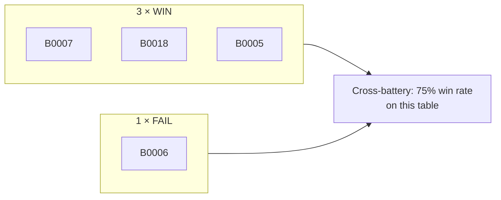
```mermaid
flowchart LR
  subgraph Wins["3 × WIN"]
    W7[B0007]
    W18[B0018]
    W5[B0005]
  end
  subgraph Loss["1 × FAIL"]
    L6[B0006]
  end
  Wins --> Summary["Cross-battery: 75% win rate<br/>on this table"]
  Loss --> Summary
```

*Baseline note:* `hybrid_pipeline_case2.py` uses **`H2O_MAE`** per test cell (e.g. B0005 → **0.0107**). Some slides reuse **Case-1** benchmark MAE (**0.0097** for B0005 from `hybrid_pipeline.py`); label which table you cite so comparisons stay consistent.

**Honesty for committee:** Case-2 **script** marks **Beat?** against **hybrid** vs H2O. If your slides claim **Chronos-only** wins, cite the **Chronos cal.** columns or CSV (`pred_chronos_cal`), not the hybrid **Beat?** column unless you align the claim.

### 11.4 Case 3 — Hybrid vs H2O (reference LOO run)

**Script:** [`hybrid_model_case3.py`](code+data/code+data/dataset/hybrid_model_case3.py). **Hybrid** = calibrated Chronos + residual ensemble (+ optional confidence gate). **Hybrid RMSE** = **√MSE** exactly. **H2O** targets are the **explicit** `H2O_MAE` / `H2O_RMSE` dicts in that file (Case-3 table differs from Case-1 / Case-2 baseline tables — cite the correct source).

| Test battery | H2O MAE | Hybrid MAE | Beat MAE? | H2O RMSE | Hybrid RMSE | Beat RMSE? | Overall |
|--------------|---------|------------|-----------|----------|-------------|------------|---------|
| **B0005** | 0.0139 | 0.003080 | Yes | 0.0178 | 0.005122 | Yes | **WIN** |
| **B0006** | 0.0141 | 0.015879 | No | 0.0181 | 0.032191 | No | Fail |
| **B0007** | 0.0169 | 0.004169 | Yes | 0.0217 | 0.008644 | Yes | **WIN** |
| **B0018** | 0.0101 | 0.003278 | Yes | 0.0129 | 0.005895 | Yes | **WIN** |

**Aggregate:** **3 / 4** folds beat H2O on **both** MAE and RMSE (goal ≥ 3/4). **B0006** is the outlier fold (see §8.14 prediction figure — late-test flattening vs continued degradation).

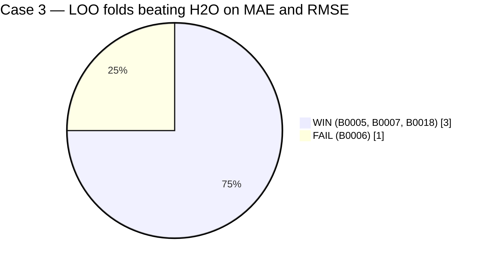
```mermaid
pie showData
  title Case 3 — LOO folds beating H2O on MAE and RMSE
  "WIN (B0005, B0007, B0018)" : 3
  "FAIL (B0006)" : 1
```

### 11.5 Exported artifacts

- **Case 2:** `HIS/case2_c{idx}_{train}_{test}_test_{B}.csv` — use for plots in papers/talks.
- **Case 3:** `HIS/case3_results.csv`; figures under [`dataset/plots/`](code+data/code+data/dataset/plots/) (`case3_loss_*.png`, `case3_prediction_*.png`).
- **Case 1 Chronos caches:** `chronos_*.npy` under `HIS/` (see `.gitignore` — may be excluded from git).

---

## 12. Troubleshooting

| Symptom | Likely cause | What to do |
|---------|--------------|------------|
| `FileNotFoundError` for CSV | Wrong **`HIS_DIR`** | Fix path in `hybrid_pipeline.py` or run Case 2 from dataset folder with CSVs in `HIS/`. |
| `expected 3000 rows` (Case 2) | CSV too short after `tail(3000)` | Ensure each battery file has ≥ **3000** rows. |
| CUDA / `bucketize` device error | Context tensor device mismatch | Code forces **CPU float32** context into `predict()`; update repo if you changed that. |
| `WinError 126` / `caffe2_nvrtc.dll` | Broken CUDA PyTorch install | Reinstall matching **torch + CUDA** wheels or use **CPU** torch. |
| OOM on GPU | Batch too large | Set **`CHRONOS_INFER_BATCH`** to a smaller value. |
| CUDA OOM on **Case 3** (small GPU) | Chronos **T5-base** + `num_samples=32` | Script auto-caps batches; use **`CHRONOS_LOW_VRAM=1`**, **`CASE3_LOW_VRAM=1`**, or **`PYTORCH_CUDA_ALLOC_CONF=expandable_segments:True`**. |
| Slow runs | `num_samples=12` × two contexts | Reduce **`CHRONOS_NUM_SAMPLES`** or use single context (`CHRONOS_SINGLE_CONTEXT` / env) on Case 1. |

---

## 13. Citation and license

### 13.1 Chronos

If you use **Amazon Chronos**, cite the **official Chronos paper** and respect the model license on Hugging Face:

- [amazon/chronos-t5-base](https://huggingface.co/amazon/chronos-t5-base)

### 13.2 Remote

```text
https://github.com/ujjwaltiwari01/GenAI-researchpaperRUL-code-and-paper.git
```

### 13.3 License

Add a **`LICENSE`** file per your institution’s policy if you distribute publicly (e.g. MIT, Apache-2.0).

---

<div align="center">

**Built for reproducible battery HI forecasting research**

*Diagrams: Mermaid (GitHub-native) · Tables: experiments + embedded baselines*

</div>
